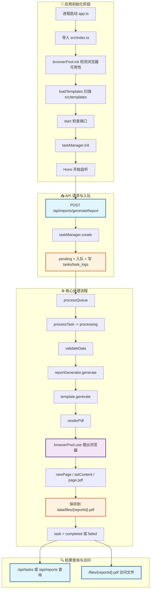

# FileService 生命周期流程梳理

## 1. 这份文档看什么

这份文档按“生命周期”来梳理当前项目的主流程，重点覆盖：

- 路由如何接住请求
- 模板如何被发现、校验、执行
- 任务如何创建、排队、保存到硬盘、查询、清理
- 浏览器池如何初始化、借出、归还、关闭

> 注：现有部分旧文档还在提
> `templateManager`、`src/templates/index.ts`。但以当前代码为准，实际实现已经是
> `src/core/templateLoader.ts` + `src/templates/*` 目录扫描。

## 2. 核心模块分工

- `app.ts`：进程入口，检查端口、初始化任务管理器、启动 Hono 服务、处理优雅关闭。
- `src/index.ts`：应用装配入口，初始化浏览器池、扫描模板、注册中间件和路由。
- `src/routes/reports.ts`：创建报告生成任务、按 `reportId` 查询任务。
- `src/routes/tasks.ts`：查询任务列表/详情、删除任务记录。
- `src/routes/files.ts`：列出已生成文件、直接访问文件、删除文件。
- `src/core/templateLoader.ts`：扫描模板目录，加载 `*.schema.ts`，绑定
  `pdf.html` 和生成函数。
- `src/core/reportGenerator.ts`：统一调模板生成报告结果。
- `src/core/pdfRenderer.ts`：读取 HTML，注入 Vue 运行时与数据，借助浏览器池生成 PDF。
- `src/core/browserPool.ts`：查找 Chrome/Chromium，创建 `generic-pool`
  浏览器池，提供 `use()` 封装。
- `src/core/taskManager.ts`：任务状态机、队列调度、文件落盘、任务持久化、过期清理。
- `src/core/database.ts`：SQLite 连接与 `tasks / task_logs` 表管理。

## 3. 总体生命周期图

## 4. 生命周期一：服务启动

### 4.1 模块导入阶段

当 `app.ts` 导入 `src/index.ts` 时，会先执行 `src/index.ts` 顶层初始化：

1. `browserPool.init()`
   - 查找浏览器可执行文件
   - 启动一次测试浏览器验证可用性
   - 创建 `generic-pool` 池实例
2. `loadTemplates(templatesDir)`
   - 扫描 `src/templates` 下所有子目录
   - 寻找 `*.schema.ts`
   - 要求同目录存在对应的 `pdf.html`
   - 动态导入 schema 模块并注册到模板注册表

### 4.2 start() 阶段

`app.ts` 中的 `start()` 再继续完成：

1. 检查端口是否被占用
2. `taskManager.init()`
   - 初始化 SQLite
   - 建表 `tasks`、`task_logs`
   - 把重启前仍处于 `pending/processing` 的任务标记为 `failed`
   - 加载历史任务到内存 Map
   - 启动定时清理器
3. 启动 Hono 服务并打印访问地址
4. 注册 `SIGINT/SIGTERM` 的优雅关闭逻辑

## 5. 生命周期二：模板装载

当前模板采用“目录即模板载体”的方式：

- 目录示例：`src/templates/test/`
- 核心文件：`pdf.schema.ts` + `pdf.html`
- `pdf.schema.ts` 负责导出：
  - `meta`：模板 ID、名称、描述
  - `schema`：Zod 数据校验规则
  - `pdfOptions`：可选的 PDF 页面配置

模板被加载后，会在注册表里变成一个 `LoadedTemplate`：

- 保留 `meta`、`schema`、`templatePath`
- 自动生成 `generate(data)` 方法
- 该 `generate(data)` 最终会调用 `renderPdf(templatePath, data, pdfOptions)`

## 6. 生命周期三：任务创建与执行

### 6.1 路由接收请求

浏览器或调用方请求 `POST /api/reports/generateReport`：

1. `reports.ts` 解析 JSON 请求体
2. 校验 `templateId`、`format`、`data` 是否存在
3. 当前只允许 `format = pdf`
4. 调用 `taskManager.create({ templateId, format, data })`

### 6.2 任务创建

`taskManager.create()` 会：

1. 先确认模板存在
2. 生成 `taskId` 与 `reportId`
3. 构造任务对象，初始状态为 `pending`
4. 生成规范文件名
5. 写入内存 `tasks` Map
6. 放入 `queue`
7. 写入 `task_logs(created)` 和 `tasks`
8. 触发 `processQueue()`

路由会立刻返回：`taskId + status + reportId`，此时通常还没有文件。

### 6.3 队列调度

`processQueue()` 的规则很直接：

- 只要队列里有任务，且 `processingCount < maxConcurrent`，就继续取任务
- 取出的任务进入 `processTask()`
- `processTask()` 完成后递减计数，并再次触发 `processQueue()`

### 6.4 单个任务处理

`processTask(task)` 的执行顺序是：

1. 状态改为 `processing`
2. 记录 `startedAt`
3. 写任务日志 `started`
4. 用 `validateData()` 校验输入
5. 调 `reportGenerator.generate()` 生成结果
6. `reportGenerator` 内部再次校验并调用模板的 `generate()`
7. 模板 `generate()` 进入 `renderPdf()`
8. `renderPdf()`：读取 HTML、注入 Vue runtime 和 `__DATA__`
9. `browserPool.use()` 借出浏览器，创建 page，执行 `page.pdf()`
10. 关闭 page，归还浏览器
11. 把 PDF 保存到 `data/files/{reportId}.pdf`
12. 更新任务为 `completed`，记录 `filePath/contentType/completedAt`
13. 如果任何一步报错，则任务置为 `failed`

## 7. 生命周期四：浏览器池

浏览器池不是“每个任务启动一个浏览器再退出”，而是：

- 服务启动时初始化池
- 任务执行时按需 `acquire`
- 每次渲染创建的是 `page`，不是新的全局池对象
- 渲染完成后关闭 `page`，再把 `browser` 归还池中
- 服务关闭时 `drain + clear`

所以复用层级是：**浏览器实例池化，页面实例按次创建/销毁。**

## 8. 生命周期五：结果查询、文件访问、清理

### 8.1 结果查询

- `GET /api/reports/getReportTask/:reportId`：按业务侧 `reportId` 查任务
- `GET /api/tasks/getTask/:taskId`：按任务 ID 查详情
- `GET /api/tasks/getAllTasks`：按状态/时间范围查看列表
- `GET /api/files/getAllFiles`：列出所有“已完成且文件仍存在”的结果

### 8.2 文件访问

- `GET /files/:filename`：读取磁盘文件并直接返回二进制内容
- 文件名格式固定为 `{reportId}.pdf`
- 即使任务是 `completed`，如果磁盘文件不存在，也会变成“结果不可用”

### 8.3 删除与清理

- `DELETE /files/:filename`：删除文件，但保留任务记录
- `DELETE /api/tasks/deleteTask/:taskId`：删除任务记录，但不会顺手删磁盘文件
- 定时清理器只会清掉过期的 `completed/failed` 任务记录，不会主动删除磁盘文件

## 9. 最值得记住的主链路

可以把当前项目记成一句话：

**路由只负责接参和回参，模板负责声明数据结构和 HTML，任务管理器负责状态与队列，真正的 PDF 生成在渲染器里通过浏览器池完成。**
