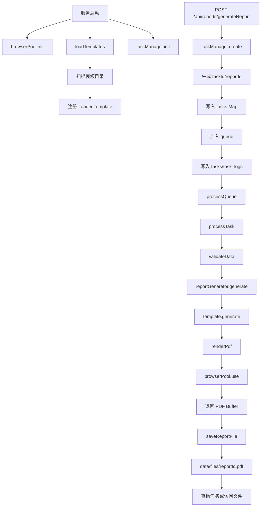
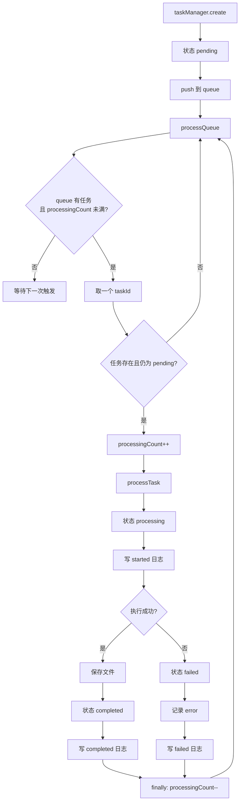
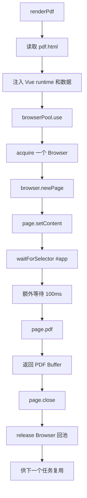
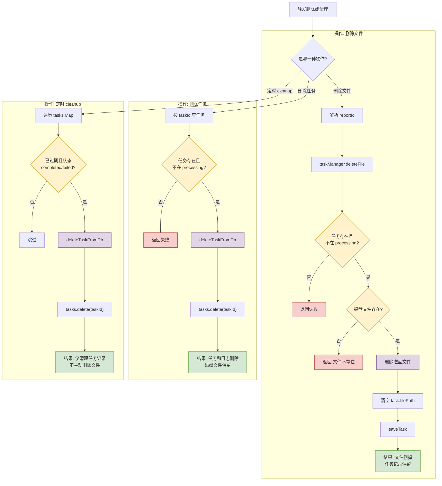

# Task 模块流程梳理

## 1. 这份文档看什么

这份文档聚焦 **task 模块**，重点不是罗列函数调用顺序，而是解释：

- 为什么系统里要有 task 这一层
- task 模块到底负责什么、不负责什么
- 从模板到报告文件的主链路为什么要经过任务系统
- 浏览器池为什么存在，以及它和任务执行是什么关系
- 删除、清理、重启恢复这些边界为什么这样设计

如果你想看全项目总览，请先读
`docs/project-lifecycle.md`。如果你想回答“**为什么报告生成不是路由里直接调模板，而是先创建任务**”，这份文档就是主参考。

## 2. 这个模块为什么存在

`task` 模块的目的，不是为了“多包一层对象”，而是为了把 **请求接收** 和
**重型报告生成** 解耦。

如果没有这层，路由就要直接承担：

- 模板查找与数据校验
- HTML 模板渲染
- 浏览器启动与页面渲染
- PDF 导出
- 文件写盘
- 错误处理与结果组织

这样会带来 4 个直接问题：

1. **HTTP 请求会被重型生成链路阻塞**
   - PDF 生成依赖浏览器进程和页面渲染
   - 单次耗时不稳定
   - 路由很难快速返回
2. **生成过程不可稳定追踪**
   - 请求结束后缺少一个持续存在的“任务实体”来承载状态
   - 很难区分“已受理 / 处理中 / 完成 / 失败”
3. **并发难以集中治理**
   - 每个请求都直接开跑，会让路由层和底层资源竞争绑死在一起
   - 浏览器资源、文件写入、失败恢复都不容易统一管理
4. **服务重启后的状态会失真**
   - 没有任务快照和任务日志，就很难知道重启前哪些任务完成了，哪些中断了

所以当前项目引入 `taskManager` 的核心目的，是把一次“生成报告”的请求变成一个
**可排队、可追踪、可持久化、可查询状态** 的后台工作项。

从实现上看，task 模块主要解决的是这 5 件事：

- 让接口快速返回，不被 PDF 生成阻塞
- 让报告生成变成一个有状态的过程
- 把并发控制集中到 manager 层处理
- 让结果可以按 `taskId / reportId` 查询
- 让服务重启后的任务状态保持可解释、可相信

## 3. 模块边界：负责什么 / 不负责什么

task 模块不是“所有逻辑的总入口”，它的职责边界很明确。

### 3.1 它负责什么

- 接收由路由创建的任务请求
- 为任务分配 `taskId` 和 `reportId`
- 维护任务状态：`pending / processing / completed / failed`
- 负责排队与并发调度
- 调用下游拿到真实的 PDF Buffer
- 负责结果落盘、状态持久化、日志记录
- 提供任务查询、结果读取、删除与清理能力

### 3.2 它不负责什么

- 不负责定义模板长什么样
- 不负责扫描模板目录和注册模板
- 不负责 HTML 模板内部的渲染细节
- 不负责浏览器池的创建策略本身
- 不负责断点续跑或自动重试
- 不负责自动清理所有磁盘文件

### 3.3 它和上下游的关系

| 方向     | 模块                                         | 关系           | task 关心什么                       |
| -------- | -------------------------------------------- | -------------- | ----------------------------------- |
| 上游     | `src/routes/reports.ts`                      | 创建任务入口   | 收到合法请求后生成任务              |
| 前置依赖 | `src/core/templateLoader.ts`                 | 提供模板注册表 | 模板是否存在、数据能否校验          |
| 下游     | `src/core/reportGenerator.ts`                | 协调生成 PDF   | 给定模板 ID 和数据，拿到结果 Buffer |
| 基础设施 | `src/core/browserPool.ts`                    | 提供浏览器资源 | 渲染时能否拿到可用浏览器            |
| 持久化   | `src/core/database.ts`                       | 保存任务与日志 | 状态和历史是否可追踪                |
| 对外访问 | `src/routes/tasks.ts`、`src/routes/files.ts` | 暴露任务与文件 | 状态和文件是否可查询                |

可以把它理解成：

**task 模块负责“管理一次生成行为的生命周期”，而不是负责“发明生成能力本身”。**

## 4. 核心对象与状态语义

这一节不是抄类型定义，而是解释：为什么这些对象存在，它们各自代表什么语义。

### 4.1 `Task`：把一次生成请求变成“可追踪实体”

`Task`
的意义，不只是存几个字段，而是把原本一次性的 HTTP 请求，变成一个能跨时间存在的对象。

它至少承载这些语义：

- **是谁**：`id`、`reportId`
- **要生成什么**：`templateId`、`format`
- **现在到哪一步了**：`status`
- **何时开始 / 结束**：`createdAt`、`startedAt`、`completedAt`
- **结果在哪里**：`filename`、`filePath`、`contentType`
- **为什么失败**：`error`

没有这个对象，系统就很难在“请求结束之后”继续描述这次生成行为。

### 4.2 `tasks Map`：运行时状态索引

`tasks: Map<string, Task>` 的目的，是让当前进程在内存里快速找到任务对象。

它解决的是“**当前进程内如何高效拿状态**”的问题，而不是持久化问题。

所以它的特征是：

- 查找快
- 适合运行时读写
- 进程重启后会丢，需要从数据库重建

### 4.3 `queue`：把接收速度和执行速度分离

`queue: string[]` 的存在目的，是把两种速度拆开：

- 路由接收请求的速度
- 后台真正执行任务的速度

只要这两个速度不拆开，HTTP 请求就会直接被底层执行能力拖慢。

### 4.4 `processingCount`：并发闸门

`processingCount` 的含义，是告诉 `taskManager`：

- 当前已有多少任务被判定为“正在处理”
- 是否还能继续从队列里放新任务出来

它控制的是 **task 层的处理并发**，不是浏览器层真实的渲染并发。

### 4.5 `TaskStatus`：状态不是标签，而是承诺

当前状态只有 4 个：

- `pending`
- `processing`
- `completed`
- `failed`

它们的价值，不在于数量少，而在于语义稳定：

- `pending`：已接收，但还没开始实际处理
- `processing`：系统已经接管并开始执行
- `completed`：流程成功结束，理论上应已有结果
- `failed`：流程结束了，但没有成功产出结果

这里要特别注意：

- `completed` 表示“任务流程成功结束”
- 不绝对等于“文件此刻一定还能访问”

因为文件可能后续被删除，所以代码里还要额外检查 `resultReady`
和真实文件是否存在。

### 4.6 `tasks` / `task_logs`：状态与历史分开保存

数据库里有两张核心表：

- `tasks`：保存当前任务快照
- `task_logs`：保存任务生命周期事件

这样拆开的目的，是同时满足两类需求：

- **看现在**：当前状态、当前文件路径、当前错误信息
- **看过程**：任务何时创建、何时开始、何时完成、何时失败

如果只存一张当前状态表，就很难回答“这个任务经历过什么”。

## 5. 主链路总览

先用一句话概括 task 模块主链路：

**模板先在启动阶段被扫描注册，路由收到请求后只负责创建任务，`taskManager`
负责入队和调度执行，真正生成 PDF 的工作由
`reportGenerator -> template.generate -> renderPdf -> browserPool`
完成，最后结果写入磁盘并通过任务接口和文件接口暴露。**

这条链路能成立，关键在于每一层只做自己该做的事：

- 路由层负责收请求
- task 层负责生命周期管理
- 模板层负责定义数据和生成入口
- 渲染层负责把 HTML 变成 PDF
- 浏览器池负责复用重型浏览器资源

## 6. 关键步骤与每一步的目的

这一节不只是列行为，而是把“做什么”和“为什么这样做”放在一起看。

### 6.1 启动前置准备：让执行环境先变得可靠

task 模块虽然负责任务生命周期，但它真正开始工作前，需要三个前提先成立：

1. 浏览器池可用
2. 模板注册表可用
3. 数据库可用

对应代码入口：

- `src/index.ts`
  - `await browserPool.init()`
  - `await loadTemplates(templatesDir)`
- `app.ts`
  - `await taskManager.init()`

这些前置初始化的目的分别是：

#### 浏览器池初始化

它不是为了“提前占资源”，而是为了 **尽早确认运行环境是否具备 PDF 生成能力**。

如果浏览器根本不可用，系统最好在启动时就失败，而不是等用户提交第一个任务时才发现。

#### 模板扫描与注册

它的目的，是让 task 层后面只需要关心：

- 某个 `templateId` 是否存在
- 对应数据是否能校验
- 是否能拿到 `generate(data)` 入口

也就是说，task 模块依赖模板能力，但不想知道模板目录是怎么组织的。

#### 任务管理器初始化

它的目的，是让系统在开始接收新任务前，先恢复一个“可相信的任务世界”：

- 表结构存在
- 历史任务被加载进内存
- 中断任务被重新定性
- 定时清理器被启动

这一步不只是“准备新任务”，也是“收口旧任务”。

### 6.2 模板如何进入 task 链路

模板能力不是在任务创建时临时拼出来的，而是在启动时先被 `templateLoader`
注册成统一结构。

`src/core/templateLoader.ts` 的主要职责是：

1. 扫描模板目录
2. 找出 `*.schema.ts`
3. 匹配同目录下的 `pdf.html`
4. 动态导入 schema 模块
5. 检查 `meta.id` 是否重复
6. 组装统一的 `generate(data)`

这个统一的 `generate(data)` 最终会调用：

- `renderPdf(templatePath, data, pdfOptions)`

这一步的目的不是“现在就生成报告”，而是先把模板加工成 task 模块能理解的统一能力接口。这样 task 层只需知道：

- 用 `getTemplate(id)` 能不能拿到模板
- 用 `validateData(templateId, data)` 能不能校验数据
- 调 `generate(data)` 能不能拿到 PDF Buffer

### 6.3 创建任务：把一次请求变成后台工作项

入口在 `src/routes/reports.ts` 的 `POST /generateReport`。

路由层故意只做轻量工作：

1. 解析请求体
2. 读取 `templateId / format / data`
3. 拒绝缺参
4. 拒绝当前不支持的格式
5. 调用 `taskManager.create({ templateId, format, data })`
6. 立即返回 `taskId / reportId / status`

它不直接生成 PDF，目的很明确：

- 让接口尽快返回
- 让生成过程进入可追踪的后台状态
- 避免把路由写成重型执行入口

### 6.4 `taskManager.create()`：建立任务身份并入队

`src/core/taskManager.ts` 的 `create()` 会：

1. 用 `getTemplate(request.templateId)` 检查模板是否存在
2. 生成 `taskId` 和 `reportId`
3. 构造初始 `Task`，状态为 `pending`
4. 写入 `tasks Map`
5. 把 `taskId` 压入 `queue`
6. 记录 `created` 日志
7. 持久化到 `tasks` 表
8. 触发 `processQueue()`

这一步最重要的目的，是：

**把一个短生命周期的 HTTP 请求，转换成一个长生命周期、可被持续观察的任务。**

### 6.5 排队与调度：不是马上做，而是按系统承受能力做

`processQueue()` 的行为不复杂，但它的设计目的很重要。

它会在满足条件时持续取任务：

- 队列里还有任务
- `processingCount < maxConcurrent`

然后：

1. `queue.shift()` 取一个 `taskId`
2. 找到对应 `Task`
3. 只处理仍为 `pending` 的任务
4. `processingCount++`
5. 调 `processTask(task)`
6. 在 `finally` 里 `processingCount--` 并继续下一轮

这样设计的目的，是把“系统愿意受理多少任务”和“系统此刻愿意真正放行多少任务执行”分开。

默认配置里：

- `taskManager.maxConcurrent = 10`

它不表示系统能同时完成 10 个 PDF 渲染，只表示 task 层最多允许 10 个任务进入
`processing` 流程。

### 6.6 执行任务：把待处理推进到完成或失败

真正执行单个任务的是 `processTask(task)`。

它的顺序是：

1. 状态改成 `processing`
2. 记录 `startedAt`
3. 写 `started` 日志
4. 回写任务快照
5. 调 `validateData()` 校验模板数据
6. 调 `reportGenerator.generate()`
7. 把结果落盘
8. 记录 `filePath` 和 `contentType`
9. 成功则改成 `completed`
10. 失败则改成 `failed`

这一段的目的，不只是“执行任务”，更是保证：

- 状态变化对外可见
- 成功和失败都有持久化记录
- 即使用户稍后再查，也能知道任务停在哪个阶段

换句话说，`processTask()`
的职责不是“只求把 PDF 生出来”，而是“**把一次执行过程稳定地落到可追踪状态机里**”。

### 6.7 生成 PDF：task 负责发起，渲染层负责产出

`taskManager` 不直接碰 Puppeteer 细节，它通过下游链路拿结果：

`processTask()` -> `reportGenerator.generate()` -> `template.generate()` ->
`renderPdf()`

拆成这几层的目的，是让各层职责保持清晰：

#### `reportGenerator`

它是协调层，目的是统一“给模板 ID + 数据，返回生成结果”这件事。

#### `template.generate()`

它由 `templateLoader`
在注册模板时动态封装，目的不是让 task 模块理解模板目录细节，而是给 task 暴露一个统一生成入口。

#### `renderPdf()`

它的目标，是把“模板 HTML + 数据”变成浏览器可渲染页面，再导出成 PDF Buffer。

当前过程会：

1. 读取 `pdf.html`
2. 注入 Vue runtime 和数据
3. 向浏览器池借一个 `Browser`
4. 新建 `Page`
5. `setContent()`
6. 等待 `#app`
7. 额外等待 100ms
8. 调 `page.pdf()`
9. 关闭页面并返回 Buffer

它解决的是“**如何把模板内容稳定转成 PDF 二进制结果**”的问题。

### 6.8 浏览器池：把重型浏览器资源变成可复用基础设施

`browserPool` 的存在目的，是让浏览器从“一次性临时资源”变成“可复用基础设施”。

如果每个任务都自己决定怎么找 Chrome、怎么启动浏览器、怎么回收资源，整个系统会非常难控。

当前实现里，浏览器池会：

- 启动时寻找可用浏览器路径
- 先做一次启动测试
- 用 `generic-pool` 管理 `Browser` 实例
- 在 `use()` 中自动处理借出与归还

最关键的设计点是：

- **池化的是 Browser**
- **按次创建和关闭的是 Page**

这样做的目的，是在复用重型进程的同时，尽量让单次渲染仍保持隔离。

### 6.9 落盘与结果暴露：让结果脱离进程内存而存在

任务成功后，`saveReportFile()` 会把结果写到：

- 目录：`data/files/`
- 文件名：`{reportId}.pdf`

这一步的设计目的，是让结果不依赖“某次请求的返回值”存在，而是变成可被后续访问的产物。

这解决了两个问题：

1. 任务完成后，调用方可以稍后再取文件
2. 服务重启后，只要文件还在，结果仍可访问

对外访问主要通过两类接口：

- 任务接口：看状态
- 文件接口：拿二进制内容

所以系统同时存在：

- `GET /api/reports/getReportTask/:reportId`
- `GET /api/tasks/getTask/:taskId`
- `GET /api/tasks/getAllTasks`
- `GET /api/files/getAllFiles`
- `GET /files/:filename`

它们解决的不是同一个问题：

- 前几类解决“**现在到哪一步了**”
- 文件接口解决“**文件内容怎么拿**”

## 7. 为什么这样设计

这一节专门回答“为什么是现在这套设计，而不是别的设计”。

### 7.1 为什么要异步任务，而不是路由同步生成

因为当前生成链路包含：

- 数据校验
- 模板渲染
- 浏览器页面加载
- PDF 导出
- 文件写入

这些步骤既重又不稳定，直接挂在路由里会让接口体验和资源治理都变差。

所以当前设计更偏向：

- 路由快返回
- 后台慢执行
- 状态可追踪

这个选择获得了更好的可观察性和可控性，但代价是：

- 调用方不能在一个请求里直接拿最终文件
- 需要额外查状态或走文件访问接口

### 7.2 为什么 task 层不直接理解模板细节

因为 task 层的目标是管理生命周期，不是管理模板协议。

如果 task 层直接去理解：

- 模板目录怎么命名
- HTML 文件放哪里
- schema 模块怎么导出

它就会和模板系统强耦合。

当前设计通过 `templateLoader` 先把模板加工成统一的
`LoadedTemplate`，让 task 只关心：

- 模板是否存在
- 数据能否校验
- 能否执行 `generate(data)`

好处是职责清楚，代价是模板系统必须先完成注册，task 才能正常工作。

### 7.3 为什么要池化 Browser，而不是每次重新拉浏览器

因为浏览器进程是整个链路里最重的资源之一。

每次从零启动浏览器虽然“隔离感最强”，但代价很大：

- 启动成本高
- 资源波动大
- 并发时更容易失控

当前系统选择复用 `Browser`、按次新建 `Page`，本质上是在平衡两件事：

- 资源复用
- 单次渲染隔离

这不是最极致的隔离方案，但对当前项目更务实。

### 7.4 为什么任务并发上限和浏览器池上限不是同一个值

当前默认值是：

- `taskManager.maxConcurrent = 10`
- `browserPool.max = 5`

这意味着：

- task 层允许最多 10 个任务进入 `processing`
- 但浏览器层最多只允许 5 个浏览器实例同时被借出

结果就是：

- task 状态可以更早推进到 `processing`
- 一部分任务会在获取浏览器阶段等待

好处是 task 层不必和浏览器池上限死绑；代价是：

- `processing` 不等于“已经在跑 `page.pdf()`”
- 任务状态比底层真实进度更粗粒度

### 7.5 为什么会重复校验模板数据

当前链路里，模板数据至少会经过两次校验：

- `processTask()` 一次
- `reportGenerator.generate()` 一次

从纯性能看，这有重复；但从实现倾向看，它更偏向“安全冗余”，而不是“最少校验次数”。

好处是：

- 上下游都不完全信任输入
- 任一层被单独调用时，也不容易绕过校验

代价就是多了一点重复工作。

### 7.6 为什么重启后直接标记失败，而不是尝试续跑

因为当前系统没有实现断点续跑能力。

在这个前提下，如果重启后继续保留：

- `pending`
- `processing`

这些状态就会变得不可信——看上去像“还在处理中”，实际却没有任何执行上下文存在。

所以当前实现选择：

- 把未完成任务统一改成 `failed`
- 用 `SERVER_RESTART` 标明原因

这体现的是“**状态可信**”优先，而不是“自动恢复”优先。

## 8. 失败、恢复与清理策略

这一节关注的不是成功路径，而是系统在不顺利时如何保持可理解、可追踪。

### 8.1 执行失败时怎么处理

只要 `processTask()` 中任一步抛错，任务就会：

- 状态改成 `failed`
- 记录 `completedAt`
- 归一化错误对象
- 写入 `failed` 日志
- 回写 `tasks` 表

这样做的目的，是让失败也成为“有状态、可追踪”的结果，而不是只在控制台打一条错误。

### 8.2 服务重启后怎么恢复

`taskManager.init()` 内部在加载历史任务时，会先把数据库里遗留的：

- `pending`
- `processing`

统一改成 `failed`，并标记为 `SERVER_RESTART`。

这一步恢复的不是执行，而是恢复“**可信状态**”。

当前系统恢复的是：

- 任务快照
- 文件路径
- 时间信息
- 错误信息

当前系统不恢复的是：

- 原始输入数据的完整内容
- 中断任务的继续执行能力

特别注意：`Task.data` 没有写入数据库，所以 `rowToTask()`
从数据库恢复任务时，`data` 会是空对象。

### 8.3 删除与清理为什么要分开

当前实现里有三类很容易混淆的动作：

1. 删除文件
2. 删除任务记录
3. 清理过期任务

它们看起来都像“删东西”，但目的完全不同。

#### 删除文件：解决“产物回收”问题

`DELETE /files/:filename` 会：

- 解析出 `reportId`
- 调 `taskManager.deleteFile(reportId)`
- 删除磁盘文件
- 清掉 `task.filePath`
- 保留任务记录

它的目的，是让文件产物消失，但不抹掉这次任务曾经存在过。

#### 删除任务记录：解决“任务追踪信息回收”问题

`DELETE /api/tasks/deleteTask/:taskId` 会：

- 删除 `tasks` 表中的记录
- 删除 `task_logs` 表中的日志
- 从内存 `tasks Map` 中移除

它的目的，是让任务从系统视角消失；但它**不会顺手删除磁盘文件**。

#### 定时清理：解决“任务表膨胀”问题

`cleanup()` 只清理：

- 已过期
- 且状态为 `completed / failed`

的任务记录。

它的目标，是控制内存和数据库中的任务规模，而不是做全量文件回收。

这说明当前设计是故意把：

- **任务记录生命周期**
- **磁盘文件生命周期**

分开管理。

好处是更保守，避免后台清理器误删用户还要访问的文件；代价是会出现“任务已删但文件仍在”或“文件已删但任务仍在”的分离状态。

## 9. 流程图

这一节的图不是重复正文，而是分别强调不同视角：

- 主链路图：看整体路径
- 调度图：看状态如何推进
- 浏览器池图：看资源如何借出和归还
- 删除/清理图：看三种回收动作的边界

### 9.1 主链路流程图

这张图强调的是：**从模板能力到最终文件暴露，中间为什么要经过 task 层。**

### 9.2 任务调度与状态流转图

这张图强调的是：**task 层如何把“已受理任务”推进成“完成或失败状态”。**

### 9.3 浏览器池与 PDF 渲染流程图

这张图强调的是：**PDF 生成为什么要依赖浏览器池，而不是每次各自管理浏览器。**

### 9.4 删除/清理流程图

这张图强调的是：**三种“删除”行为解决的不是同一个问题。**

## 10. 容易误解的点

下面这些点最容易让人“看完代码以为懂了，实际上理解偏了”：

1. **任务创建成功，不代表文件已经生成成功**
   - `create()` 只是建任务、入队、持久化
2. **`processing` 不等于已经进入 `page.pdf()`**
   - 任务可能还在等浏览器池资源
3. **`completed` 不等于文件一定还可访问**
   - 文件可能后来被删掉，所以还要看真实文件是否存在
4. **`task.filename` 不等于磁盘真实文件名**
   - 磁盘实际按 `{reportId}.pdf` 存储
5. **删除任务记录，不等于删除文件**
   - 当前实现故意把两者生命周期拆开
6. **删除文件，不等于删除任务历史**
   - 文件删掉后，任务仍可能保留为 `completed`
7. **重启恢复的是状态，不是执行上下文**
   - 当前系统不会继续跑重启前中断的任务
8. **数据库恢复的任务不包含原始输入数据**
   - `Task.data` 当前没有持久化

## 11. 关键代码索引

如果你想从文档回到代码，建议按下面顺序读：

| 目的                         | 文件                                                     | 关键函数/位置                                                 | 建议怎么读                                 |
| ---------------------------- | -------------------------------------------------------- | ------------------------------------------------------------- | ------------------------------------------ |
| 看系统如何准备 task 运行环境 | `src/index.ts`、`app.ts`                                 | `browserPool.init()`、`loadTemplates()`、`taskManager.init()` | 先理解 task 为什么依赖浏览器、模板和数据库 |
| 看任务如何被创建             | `src/routes/reports.ts`                                  | `POST /generateReport`、`taskManager.create()`                | 看路由如何把同步请求转成异步任务           |
| 看任务如何排队与调度         | `src/core/taskManager.ts`                                | `create()`、`processQueue()`                                  | 看 task 模块如何接管生命周期               |
| 看任务如何真正执行           | `src/core/taskManager.ts`                                | `processTask()`                                               | 看状态流转、落盘和错误处理                 |
| 看模板如何接入 task          | `src/core/templateLoader.ts`                             | `loadTemplates()`、`getTemplate()`、`validateData()`          | 看 task 为什么不直接理解模板目录           |
| 看 PDF 如何生成              | `src/core/reportGenerator.ts`、`src/core/pdfRenderer.ts` | `generate()`、`renderPdf()`                                   | 看 Buffer 是如何被产出的                   |
| 看浏览器池如何复用资源       | `src/core/browserPool.ts`                                | `init()`、`acquire()`、`use()`、`shutdown()`                  | 看重型资源如何被统一治理                   |
| 看状态与历史如何持久化       | `src/core/database.ts`                                   | `tasks`、`task_logs` 表                                       | 看当前状态和历史事件如何拆开保存           |
| 看结果如何查询与访问         | `src/routes/tasks.ts`、`src/routes/files.ts`             | `getTask`、`getAllTasks`、`GET /files/:filename`              | 看“查状态”和“取文件”为何分开               |

## 12. 一句话总结

当前项目里的 task 模块，本质上是在做一件事：

**把“生成报告”从一次同步请求，改造成一个可排队、可追踪、可持久化、可查询状态，并依赖浏览器池稳定产出文件的后台任务过程。**
