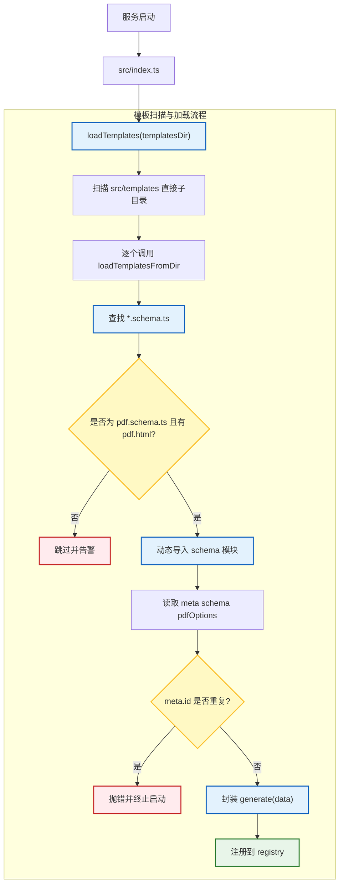
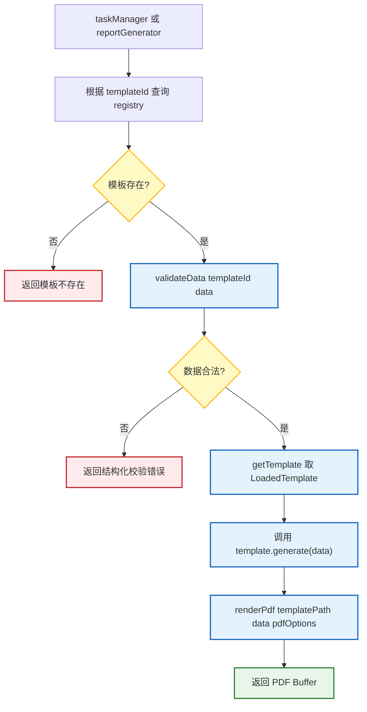
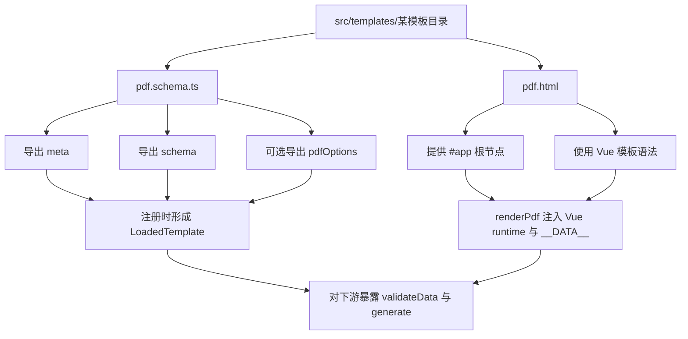

# Template 模块流程梳理

## 1. 这份文档看什么

这份文档聚焦 **template 模块**，重点不是只列“扫描了哪些文件”，而是解释：

- 为什么系统里要有 template 这一层
- 当前模板模块到底负责什么、不负责什么
- 一个模板为什么必须长成 `schema + html` 的组合
- 启动时模板是如何被发现、校验、注册成统一能力的
- 运行时为什么可以只通过 `templateId`、`validateData()`、`generate()` 就接入任务链路

如果你想先看全项目总览，请先读 `docs/project-lifecycle.md`；如果你想看模板进入任务执行后的完整链路，请再配合读 `docs/task-module-flow.md`。

这份文档主要回答的问题是：

- **为什么模板模块不是“几个静态文件”，而是一个要先注册的能力层**
- **为什么 task 模块不直接自己去读模板目录和 HTML 文件**

## 2. 这个模块为什么存在

`template` 模块的目的，不是为了给项目多加一个“模板概念”，而是为了把“**报告长什么样**”和“**报告什么时候被生成、怎么被排队**”拆开。

如果没有这层，路由或 task 模块就要直接承担：

- 去模板目录里找文件
- 判断某个模板是否存在
- 校验传入数据是否合法
- 决定该读哪个 HTML 文件
- 决定 PDF 页面大小和页边距
- 知道如何把模板文件变成真正可执行的生成函数

这样会带来几个直接问题：

1. **模板协议会散落到多个模块里**
   - 路由知道一点目录规则
   - task 再知道一点校验规则
   - 渲染层再知道一点 HTML 规则
   - 最后谁都知道一点，但没人真正负责模板协议本身
2. **新增模板的成本会变高**
   - 每加一个模板，可能就要改多个地方
   - 容易从“加一个模板”演变成“改一串业务代码”
3. **模板能力无法统一暴露给上下游**
   - 上游无法稳定地问“有哪些模板”
   - 下游无法稳定地问“给我这个模板的 generate(data)”
4. **错误暴露时机不稳定**
   - 缺文件、ID 冲突、schema 导入失败这些问题如果留到任务执行时才发现，排查会更晚、更乱

所以当前项目引入 `templateLoader` 的核心目的，是把模板目录里的散落文件，先加工成一个个 **可注册、可查询、可校验、可执行** 的模板能力对象。

从实现上看，template 模块主要解决的是这 5 件事：

- 统一模板目录约定
- 在启动时发现并注册模板
- 用 Zod 统一做数据校验
- 给下游暴露统一的 `generate(data)` 入口
- 把模板协议和 task / route / renderer 的其余职责解耦

## 3. 模块边界：负责什么 / 不负责什么

template 模块不是“所有和报告相关的逻辑都归它管”，它有很明确的边界。

### 3.1 它负责什么

- 扫描模板根目录下的候选子目录
- 识别 `*.schema.ts` 文件并匹配对应格式模板文件
- 动态导入模板 schema 模块
- 维护模板注册表 `registry`
- 对模板 ID 做唯一性约束
- 为每个模板组装统一的 `generate(data)` 方法
- 提供 `getTemplate()`、`hasTemplate()`、`listTemplates()`、`validateData()`

### 3.2 它不负责什么

- 不负责接 HTTP 请求
- 不负责创建任务或维护任务状态
- 不负责文件落盘和文件 URL 暴露
- 不负责浏览器池的生命周期管理
- 不负责 PDF 页面真正渲染时的浏览器细节
- 不负责模板执行结果的持久化
- 不负责热更新模板或运行时动态卸载模板

### 3.3 它和上下游的关系

| 方向 | 模块 | 关系 | template 关心什么 |
| --- | --- | --- | --- |
| 上游入口 | `src/index.ts` | 启动时触发加载 | 模板目录是否可扫描、能否完成注册 |
| 下游执行 | `src/core/reportGenerator.ts` | 通过模板生成结果 | `templateId` 是否存在、能否返回统一 `generate(data)` |
| 校验调用方 | `src/core/taskManager.ts`、`src/core/reportGenerator.ts` | 在执行前做数据校验 | 给定 `templateId` 时 schema 是否可用 |
| 渲染基础设施 | `src/core/pdfRenderer.ts` | 执行实际 PDF 渲染 | 是否拿到 `templatePath`、`pdfOptions`、输入数据 |
| 对外展示 | `src/index.ts` 根路由 | 暴露模板列表 | 只返回元信息，不暴露内部实现 |

可以把它理解成：

**template 模块负责“把模板定义变成统一可调用能力”，而不是负责“安排模板何时执行、执行后怎么保存结果”。**

## 4. 核心对象与语义

这一节不是照抄类型定义，而是解释：为什么这些对象存在，它们分别代表什么语义。

### 4.1 `TemplateMeta`：给模板一个稳定身份

`TemplateMeta` 里当前最重要的是：

- `id`
- `name`
- `description?`

它的意义不是“补几个展示字段”，而是给模板一个 **稳定、可引用、可对外展示** 的身份。

其中最关键的是 `id`：

- 路由和任务系统引用模板时用它
- 注册表也是用它做 key
- 唯一性冲突也是围绕它判断

所以模板真正的身份不是目录名，也不是文件名，而是 `meta.id`。

### 4.2 `TemplateSchemaModule`：模板作者对系统的声明

每个 `*.schema.ts` 模块，实际是在向系统声明：

- 我是谁：`meta`
- 我接收什么数据：`schema`
- 我导出 PDF 时可选的页面参数是什么：`pdfOptions?`

也就是说，`TemplateSchemaModule` 本质上是 **模板与系统之间的契约面**。

### 4.3 `LoadedTemplate`：运行时真正可用的模板对象

模板在磁盘上只是文件；模板被加载后，才会变成 `LoadedTemplate`。

它包含：

- `meta`
- `schema`
- `format`
- `templatePath`
- `pdfOptions?`
- `generate(data)`

这里最关键的变化是：

- 原始模板文件只是“定义”
- `LoadedTemplate` 才是系统运行时真正能拿来用的“能力对象”

### 4.4 `registry`：模板注册表

`registry: Map<string, LoadedTemplate>` 的目的，是让系统在运行时可以通过 `templateId` 快速找到模板。

它解决的是：

- 某个模板是否存在
- 这个模板的 schema 是什么
- 这个模板的 HTML 文件在哪里
- 这个模板是否能直接生成 PDF Buffer

它不解决的是：

- 模板持久化
- 模板热更新
- 模板版本管理

当前它是一个纯内存注册表，所以它的特点是：

- 启动时构建
- 运行时读取快
- 进程重启后需要重新扫描并注册

### 4.5 `generate(data)`：对下游隐藏模板细节的统一入口

`generate(data)` 不是模板作者手写导出的函数，而是 `templateLoader` 在注册阶段动态封装出来的。

它的意义是：

- 让下游不用关心 HTML 文件路径
- 让下游不用关心 `pdfOptions` 从哪里来
- 让下游只需要知道“这个模板能生成 PDF Buffer”

这一步非常关键，因为它把“模板定义”变成了“可调用能力”。

### 4.6 `validateData()`：把模板数据校验收口到统一位置

`validateData(templateId, data)` 的目的，是把模板级数据校验集中收口，而不是让每个调用方各自知道 schema 细节。

它提供的语义是：

- 模板不存在时，给出统一错误
- 模板存在但数据不合法时，返回结构化校验错误
- 模板存在且数据合法时，返回经过 Zod 处理后的数据

所以它不仅是在做“布尔判断”，也是在做 **模板数据协议的统一入口**。

## 5. 主链路总览

先用一句话概括 template 模块主链路：

**服务启动时，`loadTemplates()` 扫描 `src/templates` 下的候选目录，找到 `*.schema.ts` 与对应 `pdf.html`，动态导入 schema 模块，组装成 `LoadedTemplate` 放入注册表；运行时，task / report 模块只通过 `templateId` 做查询、校验和生成，不再直接理解模板目录细节。**

这条链路之所以成立，关键在于 template 模块做了两层转换：

1. 把“磁盘文件”转换成“运行时模板对象”
2. 把“模板内部细节”转换成“下游统一接口”

## 6. 关键步骤与每一步的目的

这一节不只是列行为，而是把“做什么”和“为什么这样做”放在一起看。

### 6.1 启动时加载模板：让模板错误尽早暴露

模板不是在第一次请求到来时才临时加载，而是在 `src/index.ts` 启动阶段由：

- `const templatesDir = path.join(import.meta.dirname, "templates")`
- `await loadTemplates(templatesDir)`

主动加载。

这样做的目的，是把模板问题尽量前移到启动阶段：

- 模板目录不存在
- schema 模块导入失败
- 模板 ID 重复
- HTML 文件缺失

这些都不应该拖到用户第一次发请求时才发现。

### 6.2 模板目录约定：先把“模板长什么样”固定下来

当前实现不是任意文件都能成为模板，而是遵循一套很具体的目录约定。

以当前代码看，模板根目录是：

- `src/templates/`

其中的直接子目录都会被当作“候选目录”扫描，比如：

- `src/templates/health-report/`
- `src/templates/test/`
- `src/templates/images/`

但要注意：

**子目录只是候选载体，不等于一定会注册成模板。**

真正要成为模板，至少要满足：

- 目录下存在 `*.schema.ts`
- 当前只识别 `pdf.schema.ts`
- 同目录必须存在对应的 `pdf.html`

这样设计的目的，是让模板结构可预测，而不是让每个调用方都猜“这个模板的 HTML 放哪里、schema 叫什么”。

### 6.3 `loadTemplates()`：先按目录分批扫描候选模板

`loadTemplates(templatesDir)` 会：

1. 读取模板根目录下的直接子目录
2. 过滤掉隐藏目录
3. 逐个调用 `loadTemplatesFromDir(dirPath)`

这一层的目的，不是完成模板注册本身，而是把“模板根目录扫描”与“单个模板目录解析”拆开。

这样做的好处是：

- 根目录逻辑更简单
- 单目录解析规则更集中
- 后面如果要扩展扫描策略，修改边界更清晰

### 6.4 `loadTemplatesFromDir()`：把候选目录变成真正模板

单个目录真正被解析时，会经历这些步骤：

1. 读取目录内所有文件名
2. 找出所有 `*.schema.ts`
3. 用文件名反推出格式（当前只允许 `pdf`）
4. 生成对应的模板文件名 `pdf.html`
5. 检查该 HTML 是否存在
6. 计算 schema 路径与 HTML 路径

这里有两个很重要的边界：

#### 只支持 `pdf`

当前代码里：

- `const format = schemaFile.replace(".schema.ts", "") as "pdf"`
- `if (format !== "pdf") continue`

这说明模板模块现在不是一个“多格式通用注册系统”，而是 **先围绕 PDF 路径建立统一约定**。

#### 缺 HTML 会跳过，不会强行注册

如果目录里有 `pdf.schema.ts`，却没有 `pdf.html`，当前逻辑会：

- 打印警告
- 跳过该 schema 文件

这样设计的目的，是把“目录里有半成品模板”视为“不可注册”，而不是注册出一个运行时必炸的模板对象。

### 6.5 动态导入 schema 模块：把静态文件读成运行时契约

在找到 schema 路径后，`templateLoader` 会执行：

- `const schemaModule = (await import(schemaPath)) as TemplateSchemaModule`

然后从中解出：

- `meta`
- `schema`
- `pdfOptions`

这一步的目的，是让模板定义保留在模板目录内部，而不是集中维护一份硬编码注册表。

换句话说，当前项目的模板接入方式更接近：

- **目录自描述**
- **模块自注册信息导出**

而不是：

- 在中心文件里手工 `import xxxTemplate`
- 再手工 `registry.set(...)`

### 6.6 模板 ID 唯一性检查：保证模板引用稳定

导入 schema 模块后，`templateLoader` 会检查：

- `if (registry.has(meta.id)) throw new Error(...)`

这一步很重要，因为系统后续几乎所有引用模板的动作都依赖 `templateId`。

如果允许重复 ID，会直接破坏：

- `getTemplate(id)` 的确定性
- 任务创建时的模板选择
- 模板列表展示的稳定性

所以当前实现选择：

- **模板 ID 冲突直接视为启动错误**
- 而不是“后注册覆盖前注册”

这体现的是“引用稳定”优先，而不是“容错加载更多模板”优先。

### 6.7 动态封装 `generate(data)`：把渲染细节藏到模板内部

模板注册过程中最关键的一步，是创建：

- `const generate = async (data) => renderPdf(templatePath, data, pdfOptions)`

这一步的意义不是“少写一行调用代码”，而是：

- 把 `templatePath` 固定到模板对象里
- 把 `pdfOptions` 和模板绑定
- 让下游不再理解 HTML 文件定位规则
- 让下游只看到统一的“生成 PDF Buffer”接口

这样一来，task 或 report 模块只需要知道：

- 我拿到一个 `LoadedTemplate`
- 我可以调用它的 `generate(data)`

而不需要知道：

- HTML 在哪个目录
- 模板文件名怎么拼
- PDF 选项从哪里取

### 6.8 注册到 `registry`：把模板能力正式纳入系统

完成前面步骤后，模板会被注册为：

- `registry.set(meta.id, { ... })`

这一步标志着模板从“磁盘上的文件组合”正式变成“系统可引用模板”。

注册时保存的关键信息有：

- 模板身份：`meta`
- 校验规则：`schema`
- 渲染格式：`format`
- HTML 地址：`templatePath`
- 可选 PDF 配置：`pdfOptions`
- 统一生成入口：`generate`

之后下游所有能力，几乎都围绕这个注册表对象读取。

### 6.9 运行时读取：让下游只通过统一接口访问模板

模板加载完成后，运行时主要有四种读取方式：

#### `getTemplate(id)`

目的：拿到完整的运行时模板对象。

典型调用方：

- `taskManager.create()`：确认模板存在
- `reportGenerator.generatePdf()`：取模板并执行 `generate(data)`

#### `hasTemplate(id)`

目的：只判断是否存在，不取完整对象。

当前使用不多，但它给模块边界留了一个更轻量的存在性判断入口。

#### `listTemplates()`

目的：只暴露模板元信息，而不是把 schema、文件路径、生成函数全部暴露出去。

当前 `src/index.ts` 的根接口就是通过它返回：

- `id`
- `name`

这体现的是“**展示模板列表**”和“**执行模板**”分开。

#### `validateData(templateId, data)`

目的：让调用方无需直接接触 schema，就能复用统一校验逻辑。

当前主要调用位置有：

- `taskManager.processTask()`
- `reportGenerator.generate()`

### 6.10 模板 HTML 的真实渲染契约：不是任意 HTML 都行

表面上看，模板模块只是“schema + html”；但从当前渲染实现看，HTML 其实也隐含了一套运行时契约。

`renderPdf()` 会做这些事：

1. 读取 `templatePath` 指向的 HTML
2. 注入 Vue 运行时代码
3. 注入 `__DATA__`
4. 通过 `Vue.createApp(...).mount('#app')` 挂载
5. 等待 `#app`
6. 再执行 `page.pdf()`

这意味着模板 HTML 至少要满足这些约束：

- 页面里要有 `#app`
- 模板内容要按 Vue 模板语法来写
- 数据字段要与 schema 校验后的结构对应

所以模板模块真正定义的，不只是“文件放在哪里”，也包括“HTML 与数据如何对接”。

## 7. 为什么这样设计

这一节专门回答：为什么当前项目选择的是这套 template 设计，而不是别的方案。

### 7.1 为什么采用“目录 + 约定文件名”而不是中心化手工注册

因为当前项目更希望新增模板时只改模板自身目录，而不是每加一个模板就去改中心注册文件。

当前方式的好处是：

- 新模板接入更局部
- 模板自描述程度更高
- 主流程代码不必随着模板数量增长而频繁修改

代价是：

- 目录命名和文件命名必须遵守约定
- 错误更多在启动扫描阶段暴露

### 7.2 为什么把 schema 和 html 分开

因为它们解决的不是同一件事：

- `schema` 解决“输入数据是否合法”
- `html` 解决“页面长什么样”

如果把两者强耦合到一个更复杂的入口里，模板作者和系统调用方都更难看清边界。

当前拆分的好处是：

- 数据协议清晰
- 视觉模板清晰
- PDF 选项可以作为附属配置挂在 schema 模块上

### 7.3 为什么要在加载阶段生成统一的 `generate(data)`

因为系统下游真正想要的不是“模板的原始文件集合”，而是“一个可调用的生成器”。

如果不做这一步，task / report 模块就得自己知道：

- 模板 HTML 在哪里
- 用什么渲染函数
- PDF 参数要怎么传

这会让模板协议泄漏到多个模块。

现在的设计通过 `generate(data)` 把这些细节收住，让下游只拿统一能力接口。

### 7.4 为什么校验入口要放在 template 模块里

因为数据是否合法，本质上是模板协议的一部分，不是 route 或 task 的固有职责。

同一份数据在不同模板下，合法性定义完全可能不同；所以最自然的归属位置，就是模板自身的 schema。

把校验入口放在 template 模块里的好处是：

- 校验规则和模板定义靠得更近
- 下游不用理解具体 Zod 结构
- 未来换调用方时还能复用同一套模板校验逻辑

### 7.5 为什么当前只支持 `pdf`

从当前代码看，模板模块不是为了抽象“任意输出格式平台”，而是先围绕项目当前最核心的 PDF 场景建立一条稳定链路。

这带来的好处是：

- 目录约定简单
- 下游接口简单
- 渲染链路单一，容易跑通

代价是：

- 模板模块目前并不是多格式通用平台
- 如果以后扩展到别的格式，需要重新设计 `format` 对应文件与生成方式

### 7.6 为什么模板列表只暴露元信息，不暴露内部对象

因为模板对外展示和模板内部执行是两种不同需求。

例如根接口里只通过 `listTemplates()` 返回：

- `id`
- `name`

而不会把：

- `schema`
- `templatePath`
- `generate`

这些内部信息直接暴露出去。

这样做的目的，是避免把内部实现细节变成外部接口承诺。

## 8. 失败、恢复与扩展边界

这一节关注的不是“成功加载模板”的主路径，而是模板模块在异常和扩展场景下的边界。

### 8.1 缺少 `pdf.html` 时会怎样

如果目录里有 `pdf.schema.ts`，但没有 `pdf.html`，当前实现会：

- `console.warn(...)`
- 跳过该模板

这说明当前系统把这种情况视为：

- 有候选模板目录
- 但模板不完整
- 因此不注册

它不是致命错误，但也不会“半注册”。

### 8.2 schema 导入失败或 ID 冲突时会怎样

如果在 `loadTemplatesFromDir()` 中发生：

- 动态导入失败
- `meta.id` 重复
- 其他运行时异常

当前逻辑会：

- 打印错误
- `throw err`

因为 `src/index.ts` 在启动阶段 `await loadTemplates(...)`，所以这类错误会直接让启动失败。

这体现的是：

- **模板注册失败属于启动级问题**
- 而不是“带着坏模板继续运行”的普通警告

### 8.3 数据校验失败时会怎样

`validateData()` 不会直接抛错，而是返回统一结构：

- 成功：`{ success: true, data }`
- 失败：`{ success: false, error }`

这让调用方可以自己决定：

- 是转成 HTTP 失败响应
- 还是转成任务失败状态
- 还是继续包装成统一异常

也就是说，template 模块负责“定义校验结果”，不强行规定所有调用方怎么处理它。

### 8.4 当前没有做什么

理解 template 模块时，下面这些“没做”的事同样重要：

- 没有模板热重载
- 没有模板版本管理
- 没有跨目录递归扫描模板结构
- 没有运行时动态增删模板 API
- 没有独立的模板管理 route
- 没有非 PDF 输出格式支持

这说明当前模板模块的定位是：

- **服务启动时注册**
- **运行时稳定读取**
- **优先简单可控，而不是做成插件平台**

### 8.5 如果以后扩展模板，应该沿用什么方向

按当前实现习惯，新增模板更自然的方式是：

1. 在 `src/templates/` 下新建一个模板目录
2. 提供 `pdf.schema.ts`
3. 提供同目录 `pdf.html`
4. 保证 `meta.id` 唯一
5. 让数据结构和 HTML 占位保持一致

也就是说，优先是“补模板目录”，而不是“改 templateLoader 主逻辑”。

## 9. 流程图

这一节的图不是重复正文，而是分别强调不同视角：

- 启动加载图：看模板如何被发现和注册
- 运行时调用图：看模板如何被查询、校验和执行
- 模板契约图：看一个模板为什么必须满足当前目录与 HTML 约束

### 9.1 启动扫描与注册流程图

这张图强调的是：**模板为什么要在启动时先被加工成 `LoadedTemplate`。**

### 9.2 运行时校验与生成流程图

这张图强调的是：**下游为什么只需要知道 `templateId`，而不用自己理解模板目录。**

### 9.3 模板目录与渲染契约图

这张图强调的是：**一个模板为什么不只是“放两份文件”，而是要同时满足目录约定和渲染约定。**

## 10. 容易误解的点

下面这些点最容易让人“看完代码以为懂了，实际上理解偏了”：

1. **`src/templates` 下的每个子目录，不一定都会注册成模板**
   - 只有满足 `*.schema.ts + 对应 html` 约定的目录才会形成模板能力
2. **模板的真实身份不是目录名，而是 `meta.id`**
   - 注册表和下游引用都按 `meta.id` 走
3. **模板加载成功，不代表任意输入数据都能生成**
   - 运行时仍然要过 `validateData()`
4. **`generate(data)` 不是模板作者手写暴露的稳定 API**
   - 它是加载阶段动态封装出来的统一入口
5. **template 模块不负责文件保存**
   - 它只负责返回 PDF Buffer，不负责把文件写到 `data/files`
6. **缺少 `pdf.html` 和模板 ID 冲突，不是同一级别的问题**
   - 前者当前会跳过，后者会直接中断启动
7. **当前代码以 `templateLoader.ts` 为准，不是旧文档里的 `templateManager` / `src/templates/index.ts`**
   - 如果你看到旧规则文档中的旧命名，要以当前实现为准
8. **模板 HTML 不是任意静态页面都行**
   - 当前渲染链路默认会注入 Vue，并要求页面里有 `#app`

## 11. 关键代码索引

如果你想从文档回到代码，建议按下面顺序读：

| 目的 | 文件 | 关键函数/位置 | 建议怎么读 |
| --- | --- | --- | --- |
| 看模板模块何时开始工作 | `src/index.ts` | `templatesDir`、`loadTemplates(templatesDir)` | 先理解模板为什么在启动时就要完成注册 |
| 看模板协议如何定义 | `src/core/templateLoader.ts` | `TemplateMeta`、`TemplateSchemaModule`、`LoadedTemplate` | 先看系统把模板看成什么对象 |
| 看模板如何被扫描与注册 | `src/core/templateLoader.ts` | `loadTemplates()`、`loadTemplatesFromDir()` | 看目录约定、动态导入和唯一性检查 |
| 看模板如何提供查询与校验 | `src/core/templateLoader.ts` | `getTemplate()`、`hasTemplate()`、`listTemplates()`、`validateData()` | 看下游为什么只需要 `templateId` |
| 看模板如何接入生成链路 | `src/core/reportGenerator.ts` | `generatePdf()`、`generate()` | 看模板如何被 report / task 模块消费 |
| 看 HTML 如何真正变成 PDF | `src/core/pdfRenderer.ts` | `renderPdf()`、`injectVueRuntime()` | 看模板 HTML 的真实运行契约 |
| 看模板样例长什么样 | `src/templates/health-report/`、`src/templates/test/` | `pdf.schema.ts`、`pdf.html` | 看一个模板目录如何同时提供数据协议和页面结构 |
| 看生成结果公共类型 | `src/types/template.ts` | `GenerateResult` | 看模板生成结果如何被其他模块复用 |

## 12. 一句话总结

当前项目里的 template 模块，本质上是在做一件事：

**把 `src/templates` 里的模板文件，转换成一组可注册、可查询、可校验、可统一生成 PDF 的运行时模板能力，供 task 和 report 模块稳定消费。**